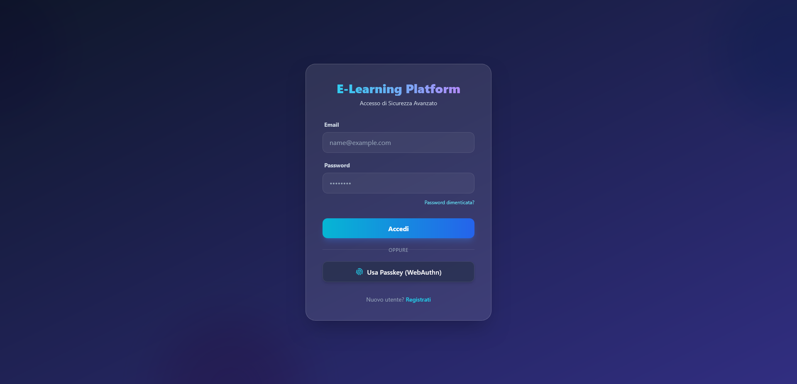
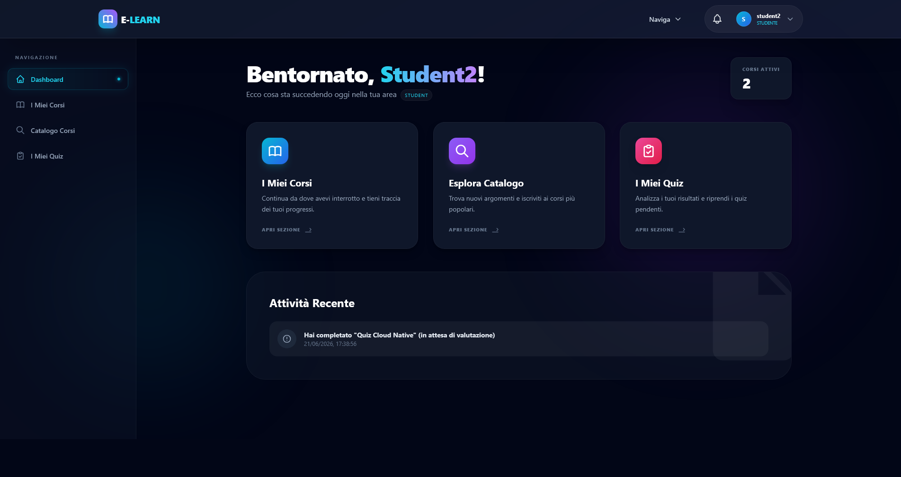
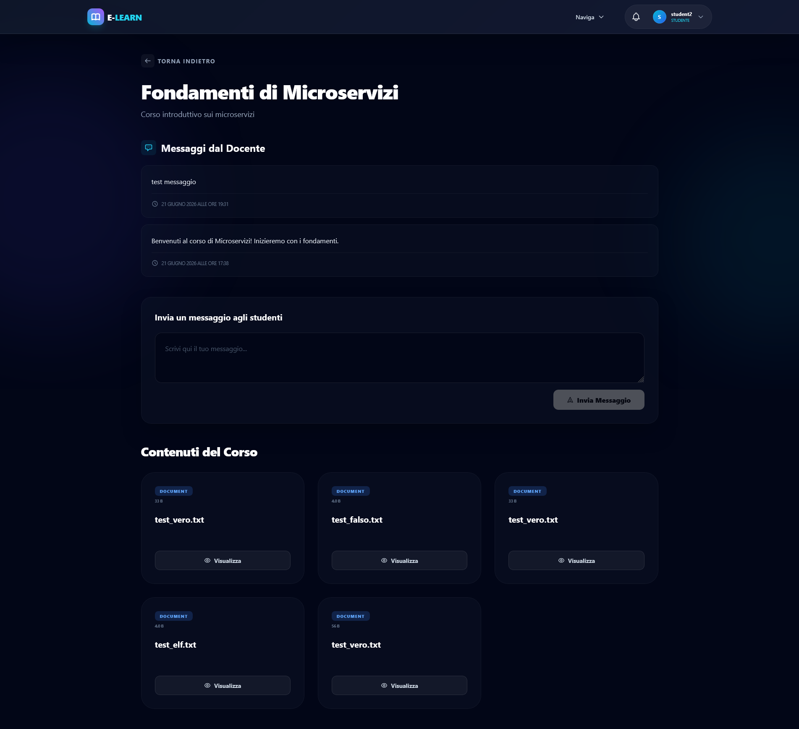
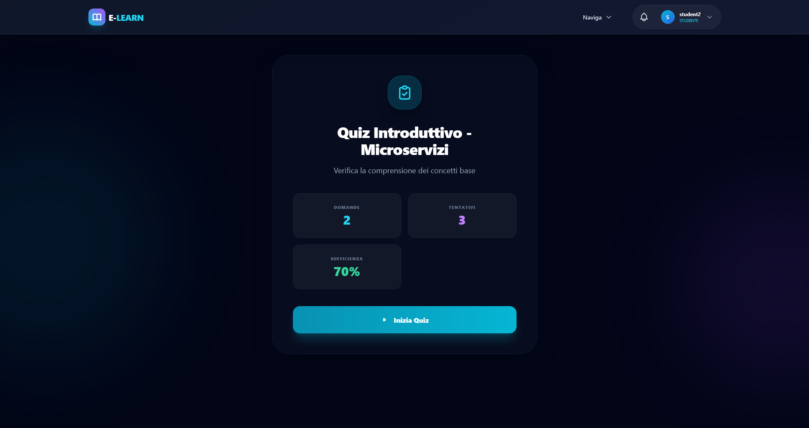
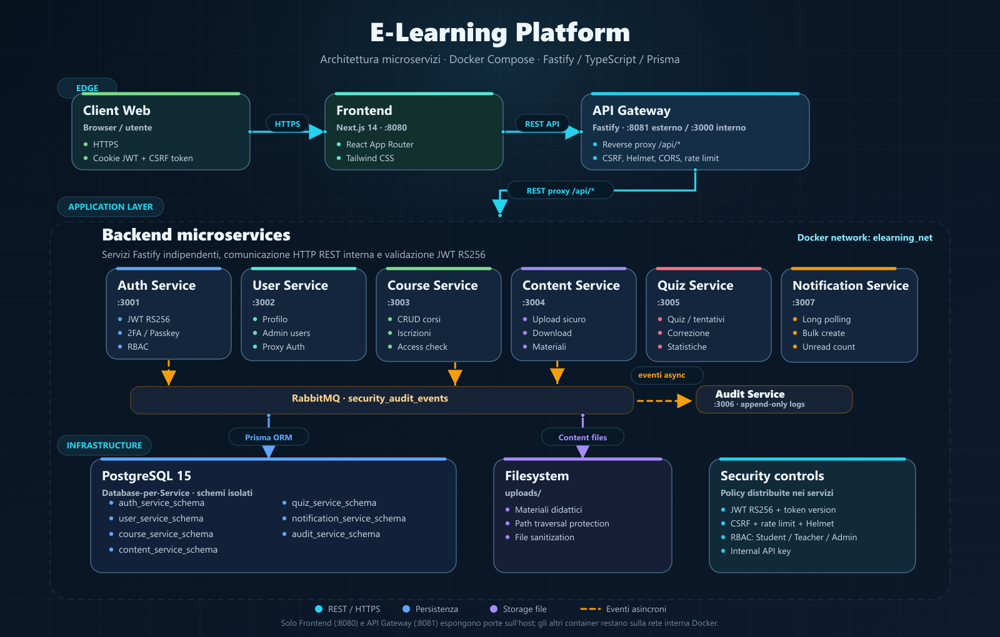

# E-Learning Platform

E-Learning Platform è una piattaforma per la gestione di corsi online, materiali didattici, quiz e notifiche, basata su un'architettura a microservizi (SOA). Sviluppata con TypeScript, Fastify e Prisma ORM per il backend, e Next.js per il frontend, offre una soluzione modulare, scalabile e sicura per ambienti educativi. L'infrastruttura containerizzata con Docker garantisce un deployment consistente e riproducibile.

## Screenshots

<p align="left">
  
</p>
<p align="left">
  
</p>
<p align="left">
  
</p>
<p align="left">
  
</p>

---

## Architettura

### 1. Panoramica

Piattaforma e-learning basata su **architettura a microservizi (SOA)**, con 8 servizi indipendenti orchestrati tramite Docker Compose. Ogni servizio ha il proprio database isolato (pattern **Database-per-Service**) e comunica via HTTP REST su una rete interna Docker.

**Stack principale:** TypeScript, Fastify, Prisma ORM, PostgreSQL, RabbitMQ.

#### Topologia di Rete

L'intera applicazione è racchiusa all'interno di una rete virtuale privata Docker chiamata `elearning_net`. Le comunicazioni esterne passano rigorosamente attraverso l'API Gateway o il frontend, garantendo l'isolamento dei microservizi di backend e dei database.

Solo due container espongono porte sull'host:

- **Frontend (web):** porta `8080`
- **API Gateway:** porta `8081`

Tutti gli altri servizi (auth, user, course, content, quiz, audit, notification) e l'infrastruttura (PostgreSQL, RabbitMQ) sono accessibili solo dalla rete interna Docker.

<p align="center">  
  
</p>

---

### 2. Servizi

#### 2.1 API Gateway (`:8081` esterno / `:3000` interno)

Punto di ingresso unico per tutte le richieste. Non contiene logica di business.

- **Tecnologia:** Fastify / TypeScript
- **Proxy inverso** verso tutti i microservizi tramite `@fastify/http-proxy`
- **CSRF protection** con double-submit cookie pattern (token via cookie `csrf-token`, verificato su header `x-csrf-token` per richieste mutative)
- **Rate limiting** globale (150 req/min per IP)
- **Helmet** con Content-Security-Policy, HSTS, X-Frame-Options, Referrer-Policy
- **CORS** configurato dinamicamente via `ALLOWED_ORIGIN`
- **Validazione Content-Type** (solo `application/json` e `multipart/form-data`)
- **Body limit** 10MB

#### 2.2 Auth Service (`:3001`)

Servizio centrale per identità e accesso. Detiene la chiave privata RSA per firmare i token JWT.

- **Tecnologia:** Fastify / TypeScript / Prisma
- **Registrazione** con verifica via email (codice 6 cifre, hash SHA-256, 5 tentativi massimi, scadenza 15 min)
- **Login** con password (bcrypt, salt round 10) e JWT
- **Refresh token** (7 giorni) con rotazione atomica e revoca su database (`revoked_tokens`), hash SHA-256 del token, replay detection con audit event
- **Token version** per invalidare tutte le sessioni di un utente (logout, cambio ruolo, reset password)
- **2FA TOTP** (libreria `otplib`):
  - Generazione secret, QR code, abilitazione con verifica
  - **Secret cifrato a riposo** con AES-256-GCM (variabile d'ambiente `TWO_FACTOR_ENCRYPTION_KEY`)
  - **Pending Login Challenge**: il login 2FA crea un record `PendingLogin` (id UUID, 5 minuti di validità, 5 tentativi massimi, mono-uso), restituendo `pendingLoginId` invece dell'UUID utente
  - **Disabilitazione 2FA protetta**: richiede password corrente + TOTP valido; incrementa `tokenVersion` ed emette audit event `TWO_FACTOR_DISABLED`
- **WebAuthn / Passkey** (`@simplewebauthn/server`) — registrazione e autenticazione senza password
- **Password reset** con token via email (hash SHA-256, scadenza 30 min)
- **RBAC**: ruoli `STUDENT`, `TEACHER`, `ADMIN` verificati su ogni richiesta
- **Rate limiting** differenziato: 10 req/min per verify-2fa, 3 per resend-code, 5 per login/register, 10 per refresh

#### 2.3 User Service (`:3002`)

Thin proxy che inoltra le richieste di gestione utenti all'Auth Service.

- **Tecnologia:** Fastify / TypeScript / Prisma
- Registrazione, verifica, profilo, lista utenti (admin)
- Invio notifiche su cambiamenti (cambio ruolo, eliminazione account)
- Invalida sessioni su modifica dati sensibili

#### 2.4 Course Service (`:3003`)

Gestione del catalogo corsi e delle iscrizioni.

- **Tecnologia:** Fastify / TypeScript / Prisma
- **CRUD corsi** con ruoli TEACHER/ADMIN (solo proprietario o admin)
- **Pubblicazione** corsi (bozza → pubblicato)
- **Iscrizione** studenti con tre modalità: libera (`FREE`), tramite chiave (`KEY`), con approvazione (`APPROVAL`)
- **Rate limiting** delle iscrizioni (10 tentativi/min per IP)
- **Messaggi** del docente agli studenti iscritti
- **Verifica accesso** API interna per altri servizi (`/:id/check-access/:studentId`)
- **Duplicati prevenuti** tramite chiave composita `courseId_studentId`

#### 2.5 Content Service (`:3004`)

Gestione e distribuzione del materiale didattico.

- **Tecnologia:** Fastify / TypeScript / Prisma
- **Upload** con validazione a più livelli:
  - MIME type consentiti (PDF, DOC, PPT, TXT, MP4, WebM, MOV)
  - Magic number validation (verifica primi byte del file contro firme note)
  - Sanitizzazione nome file (solo `[a-zA-Z0-9._-]`)
  - Limite dimensione 100MB
- **Download** con controllo accessi:
  - TEACHER/ADMIN accesso totale
  - STUDENT: solo se iscritto al corso (verifica via Course Service)
- **Path traversal protection** con `path.resolve` + `startsWith`
- **Visibilità** pubblica/privata per file (batch update disponibile)

#### 2.6 Quiz Service (`:3005`)

Creazione e somministrazione di quiz, test e verifiche.

- **Tecnologia:** Fastify / TypeScript / Prisma
- **Tipi quiz**: `ESAME` (1 tentativo), `PREPARAZIONE` (illimitati), `CUSTOM` (configurabile)
- **Stati**: `DRAFT` → `PUBLISHED` → `ARCHIVED` (pubblicazione bloccata se 0 domande)
- **Domande**: scelta multipla (`MULTIPLE_CHOICE`) e risposta aperta (`OPEN_ANSWER`)
- **Opzioni**: shuffle domande/risposte, punteggio minimo, tempo limite, punti negativi
- **Correzione**: automatica per scelta multipla, manuale per risposta aperta
- **Anti-frode**: UUID validation su ogni parametro, validazione che le risposte appartengano al quiz
- **Statistiche** per docente (media, tasso superamento, tentativi)

#### 2.7 Notification Service (`:3007`)

Gestione notifiche per gli utenti.

- **Tecnologia:** Fastify / TypeScript / Prisma
- **Creazione** notifiche singole e bulk (con `x-internal-api-key` per servizi interni)
- **Streaming** long-polling (30 secondi, check ogni 1 secondo) per aggiornamenti in tempo reale
- **Lettura** con filtro (non lette / tutte)
- **Conteggio** notifiche non lette
- **Eliminazione** singola o massiva (lette)

#### 2.8 Audit Service (`:3006`)

Tracciamento eventi di sicurezza in modo asincrono e immutabile.

- **Tecnologia:** Fastify / TypeScript / Prisma
- **Consumer RabbitMQ**: ascolta eventi da tutti i servizi sulla coda `security_audit_events`
- **Webhook sincrono**: registrazione eventi in tempo reale (admin-only)
- **Log immutabile**: scrittura sola append su database
- **Severità**: `INFO`, `HIGH`, `CRITICAL` con alert su log per eventi critici

---

### 3. Flussi di Comunicazione

#### 3.1 Login (con 2FA)

1. Il client browser carica la web app Next.js su `localhost:8080`
2. L'utente esegue il login: richiesta `POST /auth/login` all'API Gateway (`:8081`)
3. L'API Gateway instrada la richiesta all'**Auth Service** (`:3001`)
4. Se l'utente ha la 2FA abilitata, l'Auth Service:
   - Crea un record `PendingLogin` (id UUID, scadenza 5 min, attemptCount=0)
   - Restituisce `{ requires2fa: true, pendingLoginId: "uuid" }` — mai l'ID utente
5. Il client mostra il form 2FA; l'utente inserisce il codice TOTP
6. Il client invia `POST /auth/login/verify-2fa` con `{ pendingLoginId, token }`
7. L'Auth Service:
   - Verifica che il `pendingLoginId` esista, non sia scaduto, non sia già usato, abbia tentativi < 5
   - Decifra il `twoFactorSecret` con AES-256-GCM
   - Verifica il codice TOTP con `otplib`
   - Se valido: marca `usedAt`, emette JWT + refresh token (solo cookie HttpOnly)
   - Se non valido: incrementa `attemptCount`; se >= 5, blocca
8. L'API Gateway inoltra la risposta (solo cookie, nessun token nel body)
9. Per le richieste successive, ogni servizio valida il JWT tramite la chiave pubblica

#### 3.2 Accesso a un Materiale Didattico

1. **Studente** clicca "Visualizza" su un PDF del corso
2. Il **Client Web** chiama `GET /api/content/{courseId}/materials/{contentId}` con cookie JWT
3. **API Gateway** verifica CSRF token, rate limit, headers di sicurezza
4. **Content Service** riceve la richiesta, verifica il JWT tramite `jwtVerify()`
5. **Content Service** contatta l'**Auth Service** per confermare la sessione ancora valida
6. **Content Service** cerca il materiale su DB e verifica che il corso corrisponda
7. Se l'utente è TEACHER/ADMIN → stream autorizzato
8. Se il materiale è pubblico → stream autorizzato
9. Se è STUDENTE → contatta il **Course Service** per verificare l'iscrizione attiva
10. Solo se l'iscrizione è confermata, stream del file con protezione path traversal
11. **Audit Service** riceve evento `CONTENT_ACCESS` via RabbitMQ

---

### 4. Sicurezza

#### 4.1 Autenticazione

- **JWT asimmetrico RS256**: l'Auth Service firma con chiave privata, tutti gli altri servizi verificano con chiave pubblica
- **Access token**: 15 minuti di validità, solo cookie HttpOnly (mai nel body delle risposte)
- **Refresh token**: 7 giorni, con rotazione atomica e revoca su database; hash SHA-256 del token, mai il JWT in chiaro
- **Replay detection**: unique constraint su `tokenHash` — doppio uso dello stesso refresh token → 401 + audit event `REFRESH_TOKEN_REPLAY`
- **Token version**: incrementata a ogni logout, cambio ruolo, reset password o disabilitazione 2FA → tutte le sessioni precedenti invalidate
- **Cookie**: `httpOnly`, `sameSite: lax`, `secure` in produzione

#### 4.2 2FA & WebAuthn

- **TOTP**: secret generato con `otplib`, cifrato a riposo con AES-256-GCM (`TWO_FACTOR_ENCRYPTION_KEY`)
- **PendingLogin**: login 2FA non espone l'UUID utente ma un `pendingLoginId` temporaneo (5 min, 5 tentativi, mono-uso)
- **Disabilitazione protetta**: richiede password corrente + codice TOTP valido; incrementa `tokenVersion` ed emette audit event
- **WebAuthn**: registrazione e autenticazione passkey con `@simplewebauthn/server`

#### 4.3 Autorizzazione

- **RBAC** con 3 ruoli: `STUDENT`, `TEACHER`, `ADMIN`
- Ogni endpoint verifica il ruolo prima di eseguire l'operazione
- Verifica aggiuntiva di appartenenza (es. un TEACHER può modificare solo i propri corsi)
- API Gateway non contiene logica RBAC — le policy sono gestite dai singoli servizi

#### 4.4 Difese Perimetrali

| Difesa                      | Implementazione                                                                                    |
| --------------------------- | -------------------------------------------------------------------------------------------------- |
| **CSRF**                    | Double-submit cookie pattern                                                                       |
| **Rate limiting**           | Globale (150 req/min) + per-endpoint (3-20 req/min)                                                |
| **Helmet**                  | CSP, HSTS, X-Frame-Options, X-Content-Type-Options                                                 |
| **CORS**                    | Origin configuration tramite `ALLOWED_ORIGIN`                                                      |
| **Content-Type validation** | Solo JSON e multipart/form-data                                                                    |
| **Input validation**        | Zod su auth-service; validazione manuale (escapeHtml, UUID check, range check) sugli altri servizi |
| **XSS**                     | `escapeHtml()` custom su campi testuali                                                            |
| **SQL injection**           | Prevenuta da Prisma ORM (query parametrizzate)                                                     |
| **Timing attack**           | `crypto.timingSafeEqual` per API key e codici verifica                                             |

#### 4.5 Strategia Inter-Service

1. **Autenticazione Asimmetrica:** L'Auth Service detiene la chiave privata RSA (RS256) per firmare i token JWT; tutti gli altri microservizi caricano solo la chiave pubblica per validare localmente la firma.
2. **Chiavi API Interne:** Le richieste dirette tra microservizi richiedono l'header `x-internal-api-key`. La convalida avviene con `crypto.timingSafeEqual` per prevenire timing attack.
3. **Isolamento dei Dati:** Ogni microservizio ha credenziali per connettersi esclusivamente al proprio schema PostgreSQL.

#### 4.6 Upload Sicuro

- MIME type whitelist (no executables)
- Magic number validation (verifica firma del file contro il tipo dichiarato)
- Nome file sanitizzato (solo alfanumerico, niente path traversal)
- Path traversal protection con `path.resolve` + `startsWith`

---

### 5. Database

Ogni servizio possiede uno schema PostgreSQL separato (pattern Database-per-Service):

| Schema                        | Servizio             | Modelli principali                                               |
| ----------------------------- | -------------------- | ---------------------------------------------------------------- |
| `auth_service_schema`         | Auth Service         | User, Session, RevokedToken, **PendingLogin**, PasskeyCredential |
| `user_service_schema`         | User Service         | (schema vuoto — proxy verso Auth)                                |
| `course_service_schema`       | Course Service       | Course, Enrollment, TeacherMessage                               |
| `content_service_schema`      | Content Service      | Content                                                          |
| `quiz_service_schema`         | Quiz Service         | Quiz, Question, Answer, Attempt, QuestionSubmission              |
| `notification_service_schema` | Notification Service | Notification                                                     |
| `audit_service_schema`        | Audit Service        | AuditLog                                                         |

**Modelli Auth Service in dettaglio:**

| Modello             | Descrizione                         | Campi chiave                                                                                                               |
| ------------------- | ----------------------------------- | -------------------------------------------------------------------------------------------------------------------------- |
| `User`              | Utente con credenziali e preferenze | `email`, `passwordHash`, `role`, `tokenVersion`, `twoFactorSecret` (cifrato AES-256-GCM), `twoFactorEnabled`, `isVerified` |
| `RevokedToken`      | Revoca atomic refresh token         | `tokenHash` (SHA-256, unique), `userId`, `expiresAt`                                                                       |
| `PendingLogin`      | Challenge 2FA temporanea            | `userId`, `expiresAt` (5 min), `attemptCount` (max 5), `usedAt`                                                            |
| `PasskeyCredential` | Credenziali WebAuthn                | `credentialId` (Bytes), `credentialPublicKey`, `counter`                                                                   |

Tutti i servizi utilizzano **Prisma ORM** con `multiSchema` per la gestione delle migrazioni.

---

### 6. Requisiti di Sistema

- **Runtime**: Node.js 18+
- **Database**: PostgreSQL 15+ (immagine `postgres:15-alpine`)
- **Message Broker**: RabbitMQ (immagine `rabbitmq:3-management-alpine`)
- **Container**: Docker + Docker Compose
- **Rete**: rete Docker isolata `elearning_net`

---

## Utilizzo e Installazione

### Prerequisiti

L'unico requisito obbligatorio è **Docker Desktop** (o Docker Engine + Docker Compose). Non è necessario installare Node.js, npm o altro — tutto gira dentro i container.

**Windows**: [Docker Desktop for Windows](https://www.docker.com/products/docker-desktop/) con WSL2 abilitato.
**macOS**: [Docker Desktop for Mac](https://www.docker.com/products/docker-desktop/).
**Linux**: `sudo apt install docker docker-compose` (o equivalente per la tua distro).

> Il percorso in cui estrai l'archivio **non deve** contenere spazi o caratteri accentati.

### Passo 1: Verifica che le porte siano libere

Prima di avviare Docker, controlla che le porte `8080` e `8081` non siano già occupate da altri programmi (es. IIS, Apache, un altro container):

```powershell
netstat -ano | findstr :8080
netstat -ano | findstr :8081
```

Se vedi output, devi fermare il servizio che occupa quella porta o cambiare le porte in `docker-compose.yml`.

### Passo 2: Configura il file `.env`

Crea il file `.env` dal file di test già pre-compilato:

```powershell
cp .env.test .env
```

> **⚠️ Solo per test/demo locale.** Le chiavi JWT e le credenziali in `.env.test` sono pubbliche e note. In produzione: rigenera le chiavi JWT dalla sezione "Alternativa" qui sotto, e cambia `POSTGRES_PASSWORD`, `INTERNAL_API_KEY`, `COOKIE_SECRET`, `TWO_FACTOR_ENCRYPTION_KEY`.

### Passo 3: Build e avvio di tutti i container

```powershell
docker-compose up --build -d
```

Il primo avvio richiede **5-10 minuti**: Docker scarica le immagini base e installa tutte le dipendenze npm dentro ogni container. I successivi avvii saranno molto più veloci.

Per controllare l'avanzamento:

```powershell
docker-compose logs --tail=10 web
```

### Passo 4: Verifica che tutti i container siano partiti

```powershell
docker-compose ps
```

Devi vedere **11 container** tutti con stato `Up`:

```
elearning_postgres
elearning_rabbitmq
elearning_auth_service
elearning_user_service
elearning_course_service
elearning_content_service
elearning_quiz_service
elearning_audit_service
elearning_notification_service
elearning_api_gateway
elearning_web
```

Se qualche container non è ancora `Up`, aspetta 10-20 secondi e riprova.

### Passo 5: Controlla che non ci siano errori nei log

```powershell
docker-compose logs --tail=30 | Select-String -Pattern "error|Error|ERR!"
```

Se vedi errori di connessione al database, probabilmente PostgreSQL non è ancora pronto — aspetta qualche secondo, i container si riavviano automaticamente.

### Passo 6: Popola il database con dati demo

Esegui lo script automatico che crea le tabelle e popola tutti i servizi:

```powershell
.\scripts\seed-all.ps1
```

Oppure, manualmente servizio per servizio:

```powershell
docker exec elearning_auth_service npx prisma db push
docker exec elearning_auth_service node seed.js
docker exec elearning_course_service npx prisma db push
docker exec elearning_course_service node seed.js
docker exec elearning_quiz_service npx prisma db push
docker exec elearning_quiz_service node seed.js
```

Questi comandi creano le tabelle e inseriscono utenti, corsi e quiz di default.

### Passo 7: Verifica che il sistema risponda

```powershell
curl http://localhost:8081/api/health
curl http://localhost:8080
```

### Passo 8: Apri il browser e fai login

Vai su `http://localhost:8080`.

### Credenziali di Default (Demo)

| Ruolo           | Email                   | Password     |
| --------------- | ----------------------- | ------------ |
| **Admin**       | `admin@elearning.local` | `admin123`   |
| **Super Admin** | `superadmin@test.com`   | `admin123`   |
| **Docente**     | `teacher1@test.com`     | `teacher123` |
| **Studente**    | `student1@test.com`     | `student123` |

Sono presenti 2 admin, 3 docenti (`teacher1`-`teacher3`) e 5 studenti (`student1`-`student5`) con la stessa password per ruolo.


### Alternativa: rigenerare le chiavi JWT (senza openssl)

Se vuoi generare chiavi tue invece di usare quelle di default, puoi farlo direttamente con Docker — **nessun bisogno di installare openssl**:

```powershell
docker run --rm -v "$pwd:/keys" alpine sh -c "apk add openssl && openssl genrsa -out /keys/private.pem 2048 && openssl rsa -in /keys/private.pem -pubout -out /keys/public.pem"
```

Poi converti in Base64 con PowerShell:

```powershell
$jwtPrivate = [Convert]::ToBase64String([IO.File]::ReadAllBytes("$pwd\private.pem"))
$jwtPublic = [Convert]::ToBase64String([IO.File]::ReadAllBytes("$pwd\public.pem"))
Write-Host "PRIVATE: $jwtPrivate"
Write-Host "PUBLIC:  $jwtPublic"
Remove-Item -Force private.pem, public.pem
```

Copia i due valori nel `.env`.

---

## Configurazione Email

Il container `auth-service` include **Postfix** come MTA integrato, quindi **nessuna configurazione SMTP è richiesta** per l'invio di email in ambiente di sviluppo/demo.

### Come funziona

- Il Dockerfile di `auth-service` installa `postfix` + `openssl` + `mailcap` + `ca-certificates`
- All'avvio, `docker-entrypoint.sh` avvia Postfix in background prima del server Node.js
- Quando l'app chiama `sendmail` (es. per registrazione, reset password), Postfix recapita direttamente al server MX di destinazione
- Le email arrivano nella casella di posta reale del destinatario (es. Temp Mail, Gmail, Outlook)

### SMTP Opzionale (produzione)

Se vuoi usare un provider SMTP invece di Postfix:

1. Ferma il container: `docker-compose stop auth-service`
2. Modifica `auth-service/.env` con le credenziali del provider (SMTP_HOST, SMTP_PORT, SMTP_USER, SMTP_PASS)
3. Rimuovi o commenta l'installazione di Postfix in `auth-service/Dockerfile`
4. Riavvia: `docker-compose up --build -d auth-service`

### Verifica invio email

1. Registra un nuovo utente con una email reale (es. [Temp Mail](https://temp-mail.org))
2. Richiedi reset password da `http://localhost:8080/forgot-password`
3. Controlla la casella di posta

> **Nota:** Alcuni provider (Gmail, Outlook) potrebbero classificare le email come spam perché il server non ha record SPF/DKIM. Per test usa servizi come Temp Mail.

---

## Dettagli sulla Sicurezza e Sviluppo

- **Autenticazione e Autorizzazione**: Utilizza JWT asimmetrico RS256 per l'autenticazione. L'Auth Service firma i token con chiave privata, tutti gli altri servizi verificano con chiave pubblica. Access token: 15 minuti (solo cookie HttpOnly). Refresh token: 7 giorni con rotazione atomica e revoca su database (hash SHA-256). Replay detection con unique constraint su `tokenHash`. Token version per invalidare tutte le sessioni al logout, cambio ruolo, reset password o disabilitazione 2FA.

- **2FA e WebAuthn**: Supporto per autenticazione a due fattori tramite TOTP (app authenticator) con secret cifrato AES-256-GCM a riposo. Login 2FA usa `PendingLogin` temporaneo (5 min, 5 tentativi, mono-uso) invece di esporre l'UUID utente. Disabilitazione 2FA richiede password + TOTP. Login senza password tramite WebAuthn/Passkey.

- **Controllo Accessi (RBAC)**: Tre ruoli — STUDENT (iscrizione corsi, visualizzazione materiali, esecuzione quiz), TEACHER (creazione e gestione propri corsi/materiali/quiz), ADMIN (gestione globale utenti, corsi e sistema).

- **CSRF**: Double-submit cookie pattern. Il client invia l'header `x-csrf-token` che viene confrontato con il cookie `csrf-token`. Tutte le richieste mutative sono protette.

- **Rate Limiting**: Globale (150 req/min per IP) + per-endpoint differenziato (3-20 req/min) per mitigare DoS e brute-force.

- **Protezione Upload**: MIME type whitelist, magic number validation (verifica primi byte del file contro firme note), sanitizzazione nome file (solo `[a-zA-Z0-9._-]`), limite 100MB.

- **Path Traversal**: `path.resolve()` + `startsWith()` per proteggere i download.

- **XSS**: Funzione `escapeHtml()` custom applicata su tutti i campi testuali in ingresso.

- **SQL Injection**: Prevenuta da Prisma ORM (query parametrizzate).

- **Timing Attack**: `crypto.timingSafeEqual` per confronto API key e codici di verifica.

- **Comunicazione Inter-Service**: Internal API key scambiata via header `x-internal-api-key`, confrontata con `timingSafeEqual`. Ogni servizio verifica la sessione chiamando l'Auth Service.

- **Validazione Input**: Zod sull'auth-service; validazione manuale (escapeHtml, UUID check, range check) sugli altri servizi.

- **Helmet**: Content-Security-Policy, HSTS, X-Frame-Options, X-Content-Type-Options configurati sull'API Gateway.

- **Log Sicuri**: Tutti gli eventi di sicurezza (login, registrazione, accesso ai contenuti, replay token, disabilitazione 2FA) vengono pubblicati su RabbitMQ e consumati in modo asincrono dall'Audit Service, che li persiste in una tabella append-only con severità INFO, HIGH, CRITICAL.

---

## Tecnologie Utilizzate

### Backend (Microservizi)

- **Linguaggio**: TypeScript
- **Runtime**: Node.js 18+
- **Framework**: Fastify
- **ORM**: Prisma
- **Autenticazione**: JWT RS256, bcrypt, otplib, @simplewebauthn
- **Database**: PostgreSQL 15 (7 schemi isolati)
- **Message Broker**: RabbitMQ 3-management
- **Gestione Progetto**: npm

### Frontend (Next.js)

- **Framework**: Next.js 14 (React, App Router)
- **Stile**: Tailwind CSS 3
- **Gestione Dipendenze**: npm
- **Accesso**: `http://localhost:8080`

### DevOps

- **Containerizzazione**: Docker + Docker Compose (rete isolata `elearning_net`)
- **Testing**: Vitest
- **Linting**: ESLint + TypeScript strict
- **Immagini Base**: `node:20-alpine`, `postgres:15-alpine`, `rabbitmq:3-management-alpine`

---

## Troubleshooting

| Problema                         | Causa probabile                                             | Soluzione                                                                                     |
| -------------------------------- | ----------------------------------------------------------- | --------------------------------------------------------------------------------------------- |
| `port is already allocated`      | Porta 8080 o 8081 occupata                                  | `netstat -ano \| findstr :8080`, trova il PID, killalo o cambia porta in `docker-compose.yml` |
| Auth Service crasha in loop      | `COOKIE_SECRET` o `TWO_FACTOR_ENCRYPTION_KEY` non impostato | Controlla `.env` — deve avere un valore, non un placeholder                                   |
| `JWT_PRIVATE_KEY_B64` non valida | Placeholder non sostituito                                  | Usa le chiavi pronte dal passo 2 o rigenera con Docker                                        |
| `ECONNREFUSED` su PostgreSQL     | Container partiti prima del DB                              | Aspetta 20-30 sec. Docker li riavvia automaticamente                                          |
| RabbitMQ logga errori            | Rabbit non ancora pronto                                    | Normale — impiega 30-60 sec al primo avvio                                                    |
| Pagina bianca su `:8080`         | Frontend in compilazione                                    | Aspetta, controlla con `docker-compose logs web --tail=10`                                    |
| `docker exec` fallisce           | Container non ancora `Up`                                   | Verifica con `docker-compose ps`                                                              |
| `seed.js` non trovato            | File non copiato nel container                              | Esegui `docker cp seed.js <container>:/app/` o rebuilda il servizio                           |
| `Cannot find module 'bcrypt'`    | Seed vecchio                                                | Usa lo script aggiornato da `scripts/seed-all.ps1`                                            |
| `ERR_CRYPTO_INVALID_IV`          | Secret cifrato con vecchio formato IV                       | Rigenera il secret 2FA: `/2fa/generate` → `/2fa/enable`                                       |
